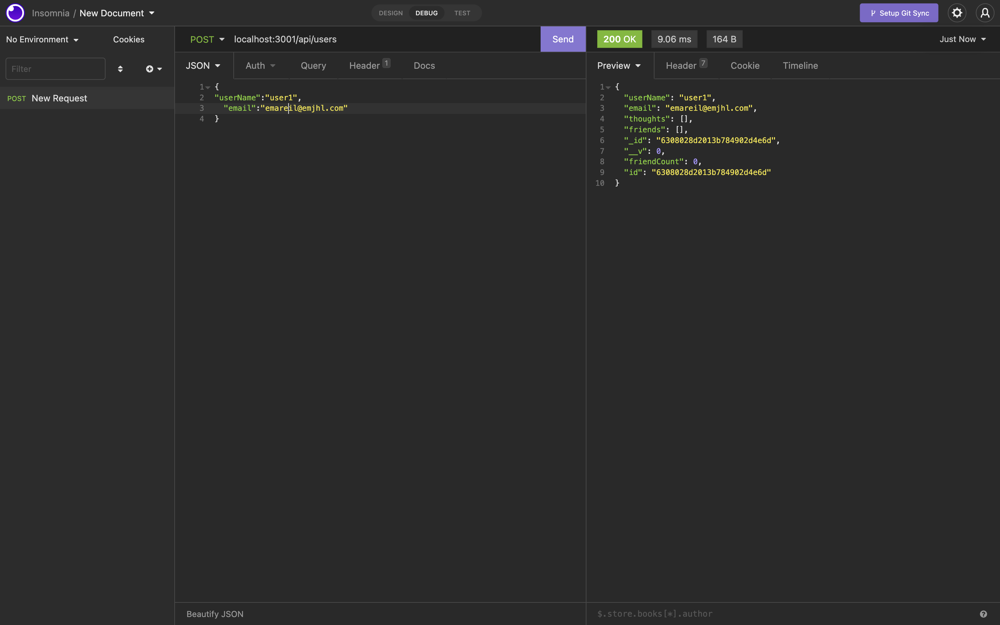

# Mongo Models and Controllers

## a social network api

This is the skeleton code for what could be a social media site's backend. It
uses mongoDB (conceived as mongoose models) to getpostputdelete users, their friend 
relationships to other users, their thoughts, and their friends' reactions to 
those thoughts. All this runs on an express.js server.

